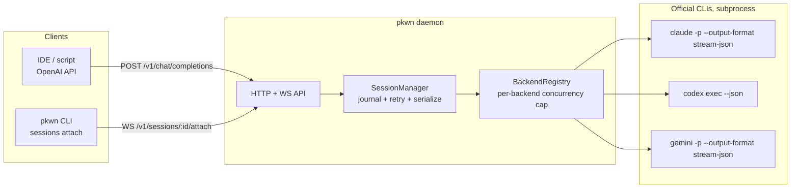

# Pkwn

A reliable, VPS-hosted connector that gives you one interface — OpenAI-compatible
HTTP API plus persistent hub-style sessions — over three coding-plan subscriptions:

| Backend  | CLI wrapped     | Plan it uses                          |
|----------|-----------------|----------------------------------------|
| `claude` | `claude` (Claude Code) | Claude Pro / Max (subscription OAuth) |
| `codex`  | `codex`                | ChatGPT Plus / Pro (subscription OAuth, token-limited) |
| `gemini` | `gemini` (gemini-cli)  | Google AI Pro / Ultra (Google account OAuth) |

## Design

**Never touches OAuth tokens.** Every backend is driven by shelling out to that
vendor's own official CLI in its documented headless/automation mode. Pkwn
only reads each CLI's own login-status output (`claude auth status`, `codex
login status`, gemini-cli's non-secret `google_accounts.json`) — it never
extracts, stores, or replays a token itself. This matters concretely:
Anthropic's consumer ToS (Feb 2026) explicitly bans OAuth-token extraction for
third-party tools, and OpenAI's ToS restricts building API-like services on
top of a consumer ChatGPT account. Wrapping the official CLI as a subprocess,
authenticated the same way you'd authenticate it interactively, stays on the
right side of both.

**"Antigravity"**: Google's Antigravity is a separate IDE/agent product from
Gemini CLI. As of this writing Antigravity's own CLI (`agy`) has no published
headless/automation contract, so Gemini-account access (Google AI Pro/Ultra)
goes through the officially documented, scriptable `gemini` CLI instead. If
Google publishes an equivalent automation contract for Antigravity CLI later,
swap `src/backends/gemini.ts` for an `antigravity.ts` adapter — the rest of
the system (session manager, API, registry) doesn't change.

**Concurrency safety**: Codex's ChatGPT-OAuth refresh token is documented by
OpenAI as unsafe to use from concurrent processes (a race can invalidate the
whole session). The registry therefore serializes all `codex exec` calls
(`maxConcurrency: 1`) unless you give each session its own `CODEX_HOME`
(config `backends.codex.homeDir`) with an independently-logged-in account.
Claude and Gemini default to modest concurrency caps (4 / 3) since their
session storage is safely keyed per working directory.

**Reliability**: every session is journaled to disk
(`~/.pkwn/sessions/<id>/{meta.json,transcript.jsonl}`) so a daemon restart —
crash, `systemctl restart`, VPS reboot — never loses session identity; an
interrupted session is marked `interrupted` on reload and can be resumed
(the backend's own `--resume`/`resume`/`-r` flag picks the conversation back
up). Turns on one session are always serialized (never two processes racing
one conversation's on-disk state). Transient failures (crashes, timeouts) are
retried with exponential backoff; rate-limit errors are surfaced immediately
as `rate_limited` without burning further retries against your quota. Every
subprocess runs in its own process group so a runaway `bash` spawned by the
agent is killed along with it on abort/timeout — never orphaned.



## Setup

```bash
npm install
npm run build
node dist/cli.js init          # writes ~/.pkwn/config.json
```

### 1. Log in to each backend you plan to use

Login always launches the vendor's own flow — Pkwn is just handing you a
terminal:

```bash
node dist/cli.js auth login claude   # opens claude's /login (browser or paste-code)
node dist/cli.js auth login codex    # codex login (browser OAuth, or --device-auth internally)
node dist/cli.js auth login gemini   # gemini's Google OAuth (NO_BROWSER=true is set automatically)
```

On a headless VPS with no browser, each of these CLIs supports a paste-a-code
flow (Claude Code's `/login`, `codex login --device-auth`, gemini-cli's
`NO_BROWSER=true`) — run the login command, then open the printed URL on
your laptop/phone and paste the code back into the SSH session.

Check status any time:

```bash
node dist/cli.js auth status
```

### 2. Configure the daemon

`~/.pkwn/config.json` (see `init` above):

```json
{
  "port": 8787,
  "bindHost": "127.0.0.1",
  "defaultTurnTimeoutMs": 1200000,
  "maxTurnRetries": 2,
  "backends": {
    "claude": {},
    "codex": { "maxConcurrency": 1 },
    "gemini": {}
  }
}
```

Environment variables override the file: `PKWN_HOME`, `PKWN_PORT`,
`PKWN_BIND_HOST`, `PKWN_API_KEY`, `PKWN_TURN_TIMEOUT_MS`,
`PKWN_MAX_RETRIES`.

**If you bind anywhere other than `127.0.0.1`, `PKWN_API_KEY` is required —
the daemon refuses to start otherwise.** For remote access prefer an SSH
tunnel or an authenticated reverse proxy (Caddy/nginx with TLS) in front of a
loopback-bound daemon over exposing it directly.

### 3. Run it

Foreground (dev): `npm run dev`

Production (VPS), via systemd:

```bash
sudo mkdir -p /opt/pkwn /etc/pkwn
sudo cp -r dist node_modules package.json /opt/pkwn/
echo 'PKWN_API_KEY=change-me' | sudo tee /etc/pkwn/pkwn.env
sudo chmod 600 /etc/pkwn/pkwn.env
sudo cp systemd/pkwn.service /etc/systemd/system/pkwn@$(whoami).service
sudo systemctl enable --now pkwn@$(whoami)
```

(`pkwn@<user>.service` runs as the same Linux user that completed the
`auth login` steps above — the backend CLIs' credentials live under that
user's home directory.)

## Using it

### Interactive chat — just run `pkwn`

This is the `omp`/`hermes`-style entry point: run the bare command (or
`pkwn chat`) against an already-running daemon and you get a REPL. Plain
lines are sent as messages to whichever session is active; `/`-prefixed
lines are commands:

```
$ pkwn
pkwn — connected. /connect <claude|codex|gemini> [cwd] to start, /help for commands, Ctrl-D to exit.
pkwn> /connect claude ~/my-project
connected — session 85bd94de-... (claude @ /home/me/my-project)
pkwn> add a health check endpoint
I'll add a /healthz route ...
pkwn> /model opus
model set to opus
pkwn> /new
started a fresh conversation — session 818d5562-...
pkwn> /sessions
  85bd94de-...  claude  idle   /home/me/my-project
* 818d5562-...  claude  idle   /home/me/my-project
pkwn> /exit
```

| Command | Effect |
|---|---|
| `/connect <backend> [cwd] [model]` | start a new session (`claude`\|`codex`\|`gemini`) and make it active |
| `/model [model-id]` | show, or set, the active session's model (per-CLI `-m`/`--model`) |
| `/permission [safe\|edit\|full]` | show, or set, the active session's approval tier |
| `/new` | fresh conversation, same backend/cwd/model — forgets backend-side history |
| `/switch <session-id>` | attach to an existing session instead |
| `/sessions` | list sessions, `*` marks the active one |
| `/stop` | abort the active session's in-flight turn |
| `/rm [session-id]` | delete a session (defaults to active) |
| `/help` | show the command list |
| `/exit`, `/quit` | leave (Ctrl-D also works) |

The REPL is a thin client — it never spawns a daemon itself. If none is
reachable it fails fast with the command to start one, rather than silently
launching a second one behind your back:

```bash
pkwn daemon &                          # dev
# or: systemctl start pkwn@$(whoami)   # production, see below
```

Detaching (`/exit`, Ctrl-D, or just closing the terminal) never kills the
active session — the daemon keeps it running; `pkwn` again and `/switch
<id>` picks it back up, from this machine or another one pointed at the
same daemon.

### OpenAI-compatible API

Model is `<backend>:<model-id>`; the daemon passes the model id straight
through to that CLI's `-m`/`--model` flag.

```bash
curl http://127.0.0.1:8787/v1/chat/completions \
  -H "authorization: Bearer $PKWN_API_KEY" -H 'content-type: application/json' \
  -d '{
    "model": "claude:sonnet",
    "cwd": "/home/me/my-project",
    "messages": [{"role":"user","content":"add a health check endpoint"}]
  }'
```

Response includes `pkwn_session_id` — pass it back as `session_id` on the
next call to continue the same backend-native conversation (only the new
last message is sent; the backend already remembers the rest):

```bash
curl http://127.0.0.1:8787/v1/chat/completions \
  -H "authorization: Bearer $PKWN_API_KEY" -H 'content-type: application/json' \
  -d '{"model":"claude:sonnet","session_id":"<id from above>","messages":[{"role":"user","content":"now add a test for it"}]}'
```

`"stream": true` gets you standard OpenAI SSE chunks. `"ephemeral": true`
skips persisting the session once the turn completes. `"permission"` accepts
`"safe"` (read-only/plan), `"edit"` (default: auto-approve file edits, still
gate riskier shell/network use), or `"full"` (bypass all approvals — each
adapter maps this to `bypassPermissions`/`--dangerously-bypass-approvals-and-sandbox`/`yolo`;
only use this if the daemon itself runs inside a container/VM you're fine
with the agent having full run of).

### Sessions API (hub-style)

```bash
# create
curl -X POST .../v1/sessions -d '{"backend":"codex","cwd":"/srv/app","permission":"edit"}'
# send a message, wait for the full turn
curl -X POST .../v1/sessions/<id>/messages -d '{"text":"run the test suite and fix failures"}'
# or watch it live over SSE
curl -N ".../v1/sessions/<id>/messages?stream=1" -X POST -d '{"text":"..."}'
# stop an in-flight turn
curl -X POST .../v1/sessions/<id>/stop
```

### Low-level: raw session control from scripts

`pkwn chat` is the human REPL; these are the same operations exposed as raw
plumbing for scripts/CI (`sessions attach` streams raw JSON events, one per
line, instead of the REPL's formatted output):

```bash
node dist/cli.js sessions list
node dist/cli.js sessions attach <id>   # WS attach: send a line, get raw JSON AgentEvents back, Ctrl-D to detach
node dist/cli.js sessions stop <id>     # abort an in-flight turn on a running daemon
node dist/cli.js sessions rm <id>       # delete a session from a running daemon
```

### Validate a fresh install without the daemon

After `auth login <backend>`, sanity-check that adapter parsing still matches
that CLI's real (possibly newer-than-tested) output before wiring it into
the daemon:

```bash
node dist/cli.js verify claude "list the files in this directory" ~/some-project
```

This runs exactly one real turn straight against the adapter — no session
persistence, no HTTP — and prints every normalized event as it streams, plus
a final OK/FAILED.

## Repo layout

```
src/types.ts              canonical AgentEvent/BackendAdapter contract every adapter normalizes to
src/process/cli-runner.ts subprocess spawn + NDJSON line streaming + process-group kill
src/process/semaphore.ts  per-backend concurrency limiter
src/backends/*.ts         one adapter per CLI (claude/codex/gemini), + registry.ts wiring them up
src/session-manager.ts    persistence, per-session serialization, retry policy
src/api/*.ts              HTTP router, OpenAI-compatible + sessions REST, WS attach
src/cli.ts                `pkwn` command line entry point
systemd/pkwn.service     production deployment unit
test/                     node:test suite (in-process fake adapter; no real CLI needed to run it)
```

## Testing

```bash
npm test          # node:test via tsx, in-process fake backend — no claude/codex/gemini binary required
npm run typecheck
```
