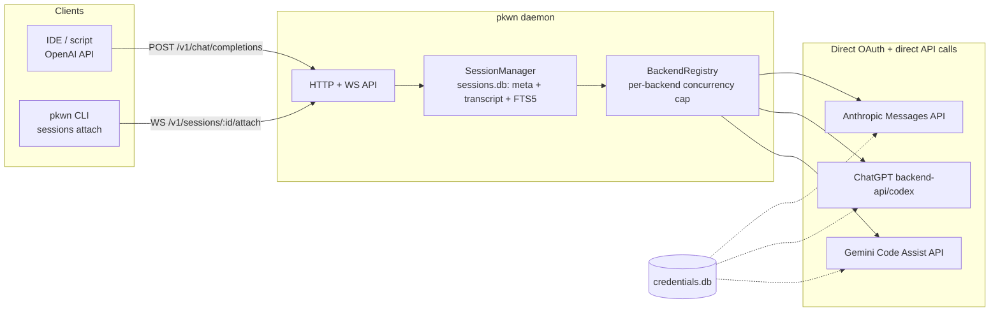

# Pkwn

A reliable, VPS-hosted connector that gives you one interface — OpenAI-compatible
HTTP API plus persistent hub-style sessions — over three coding-plan subscriptions:

| Backend  | Plan it uses                                           | API called directly |
|----------|---------------------------------------------------------|----------------------|
| `claude` | Claude Pro / Max (subscription OAuth)                  | `api.anthropic.com/v1/messages` |
| `codex`  | ChatGPT Plus / Pro (subscription OAuth, token-limited) | `chatgpt.com/backend-api/codex/responses` |
| `gemini` | Google AI Pro / Ultra (Google account OAuth)           | `cloudcode-pa.googleapis.com` (Gemini Code Assist) |

## Design

**pkwn implements its own OAuth client per backend** — the exact same
native-app authorization-code + PKCE flow each vendor's official CLI uses
(same `client_id`, same redirect target), so logging in through pkwn is
indistinguishable from logging in through that CLI. Tokens are pkwn's own —
stored locally, refreshed by pkwn, never read from or written to whatever
CLI you may or may not have installed. There is no subprocess, no CLI
binary required at all: every turn is a direct HTTP call to the same
backend API the vendor's own CLI talks to, with pkwn running the tool-call
loop (read/write/edit file, shell) itself.

**This is a real ToS tradeoff, stated plainly.** Anthropic's consumer ToS
(Feb 2026) bans OAuth-token extraction for third-party tools, and OpenAI's
ToS restricts building API-like services on top of a consumer ChatGPT
account. Driving the OAuth flow yourself (rather than shelling out to the
CLI) is a materially different risk profile than proxying a CLI subprocess,
and Anthropic in particular *actively defends* against non-CLI clients:
every Claude request must carry a specific beta-flag list, a mandatory
system-prompt identity block, and an embedded pseudo-billing-header whose
exact hash algorithm is server-validated and changes with CLI releases —
`src/backends/claude.ts` has the current best-effort reproduction (sourced
from independent reverse-engineering projects, re-derived from a live
captured request when Anthropic next changes it) and is the most likely
piece of this codebase to need re-tuning after any Claude Code release.
Codex's real traffic also sits behind Cloudflare bot mitigation the direct
client has no browser-grade fingerprint to pass reliably. Gemini's Code
Assist API is the clean case: a standard, stable, non-adversarial endpoint.
Know this before you point it at an account you can't afford to have
flagged.

**"Antigravity"**: Google's Antigravity is a separate IDE/agent product from
Gemini CLI. As of this writing Antigravity's own CLI (`agy`) has no published
headless/automation contract, so Gemini-account access (Google AI Pro/Ultra)
goes through the officially documented Code Assist API instead — the same
one the `gemini` CLI itself calls.

**Concurrency safety**: Codex's ChatGPT-OAuth refresh token is documented by
OpenAI as unsafe to refresh from concurrent processes (a race can invalidate
the whole session). The registry therefore serializes all Codex turns
(`maxConcurrency: 1`) unless you give each session its own credential home
(config `backends.codex.homeDir`) with an independently-logged-in account.
Claude and Gemini default to modest concurrency caps (4 / 3).

**Storage is SQLite**, not flat files — two databases under `~/.pkwn/`:

- `credentials.db` — one `auth_credentials` row per backend (token data,
  `identity_key`, `created_at`/`updated_at`, and a `disabled_cause` column
  that records *why* a credential stopped working — a refresh that came
  back `invalid_grant`, say — instead of the row just vanishing, so `auth
  status` can tell you what actually happened rather than only that
  you're logged out).
- `sessions.db` — a `sessions` table (metadata, including an
  auto-generated `title` from the first message) plus a `transcript_entries`
  table holding the complete raw event log for every turn: every response,
  every `reasoning`/thinking delta, every tool call and its result — file
  writes and edits report a real diff of what changed, not just a status
  string — and an FTS5 `transcript_fts` index over all of that so `/search`
  (or `sessions search` / `GET /v1/sessions/search`) can find a past
  conversation by content. Both stores run in WAL mode; a daemon and an
  ad-hoc `pkwn verify`/`auth login` invocation can touch either file at
  the same time without corrupting anything.

**Reliability**: a daemon restart — crash, `systemctl restart`, VPS
reboot — never loses session identity; an interrupted session is marked
`interrupted` on reload (the backend adapters are stateless/history-based,
so `/resume` just replays the persisted transcript back into the next
call, there is no backend-side conversation to lose). Turns on one session
are always serialized (never two turns racing one conversation's history).
Transient failures (crashes, timeouts) are retried with exponential
backoff; rate-limit errors are surfaced immediately as `rate_limited`
without burning further retries against your quota. Tool execution (shell)
runs in its own process group so a runaway command is killed along with it
on abort/timeout — never orphaned.



## Setup

Requires Node ≥ 22.5 (uses the built-in `node:sqlite` module — no native
dependency to compile).

```bash
npm install
npm run build
node dist/cli.js init          # writes ~/.pkwn/config.json
```

### 0. Gemini only: set OAuth client env vars

Claude and Codex's client_id is public and baked into pkwn directly, matching
each vendor's own CLI. Gemini's OAuth client_id/client_secret are also
public per Google's own "installed application" OAuth docs
(https://developers.google.com/identity/protocols/oauth2#installed — this
flow's secret isn't meant to stay confidential), and pkwn's values are
identical to `gemini` CLI's own published constants
(`packages/core/src/code_assist/oauth2.ts` in
[google-gemini/gemini-cli](https://github.com/google-gemini/gemini-cli)) —
but committing the literal values to this repo trips GitHub's push
protection regardless, so pkwn reads them from env instead of hardcoding
them. Copy the two constants from that file (or use your own Google Cloud
OAuth client) and set:

```bash
export PKWN_GEMINI_OAUTH_CLIENT_ID="...apps.googleusercontent.com"
export PKWN_GEMINI_OAUTH_CLIENT_SECRET="GOCSPX-..."
```

before running `auth login gemini` or starting the daemon — `claude`/`codex`
need no such setup.

### 1. Log in to each backend you plan to use

Login runs pkwn's own OAuth flow directly — no vendor CLI involved. Codex
and Gemini catch the redirect on a local callback server automatically;
Anthropic's subscription flow redirects to a fixed `console.anthropic.com`
page instead (there's no local port to catch), so you paste the code shown
there back into the prompt:

```bash
node dist/cli.js auth login claude   # prints a URL; paste back the CODE#STATE shown on the page
node dist/cli.js auth login codex    # prints a URL; completes automatically via localhost:1455/1457
node dist/cli.js auth login gemini   # prints a URL; completes automatically via a local callback port
```

Works the same on a headless VPS: open the printed URL on your laptop/phone,
authorize, then either it completes on its own (Codex/Gemini) or you paste
the code back into the SSH session (Claude).

Check status any time — a credential that stopped working shows why, not
just "not logged in":

```bash
node dist/cli.js auth status
```

### 2. Configure the daemon

`~/.pkwn/config.json` (see `init` above):

```json
{
  "port": 8787,
  "bindHost": "127.0.0.1",
  "defaultTurnTimeoutMs": 1200000,
  "maxTurnRetries": 2,
  "backends": {
    "claude": {},
    "codex": { "maxConcurrency": 1 },
    "gemini": {}
  }
}
```

Environment variables override the file: `PKWN_HOME`, `PKWN_PORT`,
`PKWN_BIND_HOST`, `PKWN_API_KEY`, `PKWN_TURN_TIMEOUT_MS`,
`PKWN_MAX_RETRIES`.

**If you bind anywhere other than `127.0.0.1`, `PKWN_API_KEY` is required —
the daemon refuses to start otherwise.** For remote access prefer an SSH
tunnel or an authenticated reverse proxy (Caddy/nginx with TLS) in front of a
loopback-bound daemon over exposing it directly.

### 3. Run it

Foreground (dev): `npm run dev`

Production (VPS), via systemd:

```bash
sudo mkdir -p /opt/pkwn /etc/pkwn
sudo cp -r dist node_modules package.json /opt/pkwn/
echo 'PKWN_API_KEY=change-me' | sudo tee /etc/pkwn/pkwn.env
sudo chmod 600 /etc/pkwn/pkwn.env
sudo cp systemd/pkwn.service /etc/systemd/system/pkwn@$(whoami).service
sudo systemctl enable --now pkwn@$(whoami)
```

(`pkwn@<user>.service` runs as the same Linux user that completed the
`auth login` steps above — credentials live in `credentials.db` under
that user's `~/.pkwn`.)

## Using it

### Interactive chat — just run `pkwn`

This is a real terminal UI (built on [Ink](https://github.com/vadimdemedes/ink)),
not a plain readline loop: it takes over the alternate screen buffer (same
mechanism vim/htop use — your shell's scrollback is untouched and restored
on exit), renders completed turns permanently above a live-updating area
for whatever's currently streaming, and every picker (`/connect`, `/model`,
`/resume`) is a real arrow-key overlay instead of a raw-mode hack bolted
onto readline. Run the bare command (or `pkwn chat`) against an
already-running daemon. Plain lines are sent as messages to whichever
session is active; `/`-prefixed lines are commands. `/connect` only *selects* a backend/model/cwd — no
session is created (and nothing shows up in `/sessions`) until you
actually type a message; that first line is what creates it. Typing
always works, even from a completely bare `pkwn>` with nothing selected —
it triggers the same arrow-key backend picker `/connect` would, then
starts the session with whatever you pick. The prompt always names the
active (or pending) `backend:model @ folder` so you never have to ask
"what am I even talking to right now." `pkwn` never auto-reattaches to an
existing session on startup — a fresh `pkwn` always starts with no
session, exactly like a fresh terminal should. What it does pre-arm is
your last backend/model *choice* for this folder (remembered in
`~/.pkwn/last-used.json`), so a returning session in a familiar folder
skips the picker too — picking up an actual old *conversation* is always
a deliberate `/resume`, never automatic:

```
$ pkwn
pkwn — connected. /connect [claude|codex|gemini] to start (pick interactively if omitted), /help for commands, Ctrl-D to exit.
pkwn> /connect claude ~/my-project
ready — claude @ /home/me/my-project — type a message to start (or /model, /permission to adjust first)
pkwn(claude:default @ my-project)> add a health check endpoint
started session 85bd94de-... (claude @ /home/me/my-project)
I'll add a /healthz route ...
pkwn(claude:default @ my-project)> ^C

$ pkwn
pkwn — ready: claude:default @ my-project (last used here) — type a message to start a new session, or /resume to reattach an existing one. /help for commands, Ctrl-D to exit.
pkwn(claude:default @ my-project)> /sessions
* 85bd94de-...  claude  idle   /home/me/my-project  — add a health check endpoint
pkwn(claude:default @ my-project)> /search healthz
* 85bd94de-...  in   2026-08-02T...  add a [healthz] endpoint
pkwn(claude:default @ my-project)> /exit
```

| Command | Effect |
|---|---|
| `/connect [backend] [cwd] [model]` | select a backend/model/cwd and make it pending — no session exists yet, so it costs nothing to change your mind. Omit `backend` for an omp-style arrow-key picker (↑/↓, Enter to select, Esc to cancel; shows live login status per backend); if the chosen backend isn't logged in yet, offers to log in inline before selecting it. The session itself is created lazily, the moment you type your first message |
| `/model [model-id]` | two-pane picker: ↑/↓ browses only *already-connected* providers on the left (unconnected ones aren't offered — `/model` switches, it doesn't log in); the right side live-updates to that provider's real model list as you move, no need to commit first. →/Enter drills into the model list and confirms; ←/Esc backs out. Populated live from each backend's own API (Anthropic `/v1/models`, Codex `chatgpt.com/backend-api/codex/models`; Gemini has none, so it's a maintained static fallback). Picking a different provider than the current one switches directly — same pending-switch semantics as `/connect`, no need to run it first. `[model-id]` sets a model on the current backend only, skipping the picker |
| `/permission [safe\|edit\|full]` | show, or set, the active session's approval tier |
| `/new` | fresh conversation, same backend/cwd/model — forgets backend-side history |
| `/resume [session-id]` | reattach to an existing session; omit id for an arrow-key list (scoped to the current folder, or all sessions if none match) |
| `/sessions` | list sessions with their auto-generated title, `*` marks the active one |
| `/search <text>` | full-text search across every session's transcript — responses, tool calls, tool results, file diffs, all of it |
| `/stop` | abort the active session's in-flight turn |
| `/rm [session-id]` | delete a session (defaults to active) |
| `/help` | show the command list |
| `/exit`, `/quit` | leave (Ctrl-D also works) |

`pkwn` self-starts the daemon (omp/hermes-style) if none answers on the
configured port: it spawns `pkwn daemon` detached — survives this process
exiting and the terminal closing — with output appended to
`~/.pkwn/daemon.log`, then waits for it to come up. Concurrent launches race
harmlessly (the loser hits `EADDRINUSE` and exits; every caller converges on
whichever daemon wins the port). This is the dev-convenience path; for a
VPS you still want the systemd unit below so the daemon survives reboots
and isn't tied to any particular terminal spawning it first:

```bash
systemctl start pkwn@$(whoami)   # production, see below
```

Detaching (`/exit`, Ctrl-D, or just closing the terminal) never kills the
active session — the daemon keeps it running; `/resume <id>` picks it back
up, from this machine or another one pointed at the same daemon.

### OpenAI-compatible API

Model is `<backend>:<model-id>` — the colon is mandatory, but the model id
after it is optional (`"claude:"` uses that backend's default).

```bash
curl http://127.0.0.1:8787/v1/chat/completions \
  -H "authorization: Bearer $PKWN_API_KEY" -H 'content-type: application/json' \
  -d '{
    "model": "claude:",
    "cwd": "/home/me/my-project",
    "messages": [{"role":"user","content":"add a health check endpoint"}]
  }'
```

Response includes `pkwn_session_id` — pass it back as `session_id` on the
next call to continue the conversation (only the new last message is
sent; the full prior history is replayed server-side from `sessions.db`):

```bash
curl http://127.0.0.1:8787/v1/chat/completions \
  -H "authorization: Bearer $PKWN_API_KEY" -H 'content-type: application/json' \
  -d '{"model":"claude:","session_id":"<id from above>","messages":[{"role":"user","content":"now add a test for it"}]}'
```

`"stream": true` gets you standard OpenAI SSE chunks. `"ephemeral": true`
skips persisting the session once the turn completes. `"permission"` accepts
`"safe"` (read-only), `"edit"` (default: read/write/edit files, still gate
shell commands against a denylist), or `"full"` (no gating at all — only
use this if the daemon itself runs inside a container/VM you're fine with
the agent having full run of).

### Sessions API (hub-style)

```bash
# create
curl -X POST .../v1/sessions -d '{"backend":"codex","cwd":"/srv/app","permission":"edit"}'
# send a message, wait for the full turn
curl -X POST .../v1/sessions/<id>/messages -d '{"text":"run the test suite and fix failures"}'
# or watch it live over SSE
curl -N ".../v1/sessions/<id>/messages?stream=1" -X POST -d '{"text":"..."}'
# stop an in-flight turn
curl -X POST .../v1/sessions/<id>/stop
# full-text search across every session's transcript
curl ".../v1/sessions/search?q=healthz"
```

### Low-level: raw session control from scripts

`pkwn chat` is the human REPL; these are the same operations exposed as raw
plumbing for scripts/CI (`sessions attach` streams raw JSON events, one per
line, instead of the REPL's formatted output):

```bash
node dist/cli.js sessions list
node dist/cli.js sessions search <text>  # full-text search across every session's transcript
node dist/cli.js sessions attach <id>    # WS attach: send a line, get raw JSON AgentEvents back, Ctrl-D to detach
node dist/cli.js sessions stop <id>      # abort an in-flight turn on a running daemon
node dist/cli.js sessions rm <id>        # delete a session from a running daemon
```

### Validate a fresh install without the daemon

After `auth login <backend>`, sanity-check that the adapter's direct-API
call still works (useful right after a vendor changes something server-side)
before wiring it into the daemon:

```bash
node dist/cli.js verify claude "list the files in this directory" ~/some-project
```

This runs exactly one real turn straight against the adapter — no session
persistence, no HTTP — and prints every normalized event as it streams, plus
a final OK/FAILED.

## Repo layout

```
src/types.ts               canonical AgentEvent/BackendAdapter/HistoryTurn contract every adapter normalizes to
src/oauth/*.ts              shared PKCE + OAuth callback server + credentials.db credential store
src/agent-tools/*.ts        the tool-execution loop every direct-API adapter drives itself: read/write/edit file, shell
src/process/cli-runner.ts   subprocess spawn + NDJSON line streaming + process-group kill (used by the shell tool)
src/process/semaphore.ts    per-backend concurrency limiter
src/backends/*.ts           one direct-OAuth + direct-API adapter per backend (claude/codex/gemini), + registry.ts wiring them up
src/session-manager.ts      sessions.db: metadata, transcript, title generation, FTS5 search, retry policy
src/api/*.ts                HTTP router, OpenAI-compatible + sessions REST, WS attach
src/cli.ts                  `pkwn` command line entry point
systemd/pkwn.service        production deployment unit
test/                       node:test suite (in-process fake adapter; no real backend login needed to run it)
```

## Testing

```bash
npm test          # node:test via tsx, in-process fake backend — no real backend login required
npm run typecheck
```
